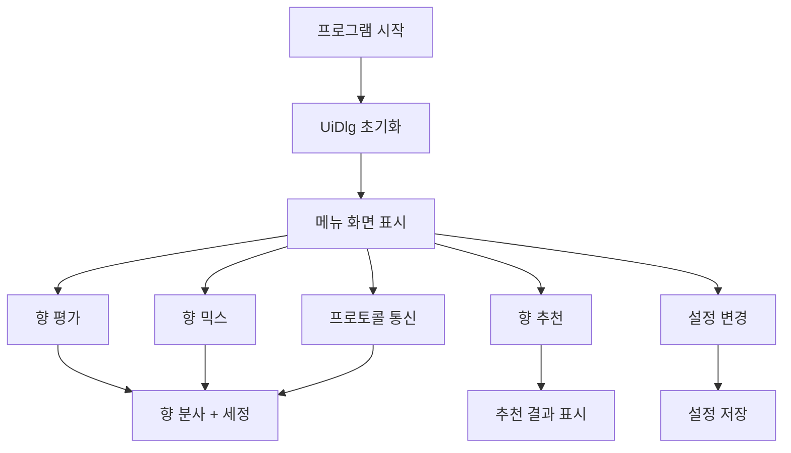

---

````markdown
# 🚀 FrSmart.py 전체 실행 흐름 및 구조 분석

FrSmart는 디지털 향기 하드웨어와 연동되는 **PySide6 기반 GUI 어플리케이션**으로, 향 분사/추천/믹스 등의 기능을 직관적 UI와 시리얼 통신으로 제어합니다.

---

## 1️⃣ 프로그램 시작 & 초기화

```python
if __name__ == '__main__':
    QtCore.QCoreApplication.setAttribute(QtCore.Qt.ApplicationAttribute.AA_ShareOpenGLContexts)
    app = QApplication(sys.argv)
    uiDlg = UiDlg()
    uiDlg.uiDlgStart()
    sys.exit(app.exec())
````

- `QApplication` 객체 생성
    
- `UiDlg()` 인스턴스 생성 및 UI 초기화
    
- 메인 메뉴 다이얼로그 표시
    

---

## 2️⃣ `UiDlg` 클래스 및 초기 설정 흐름

- 전체 UI 및 이벤트 제어를 담당하는 **메인 컨트롤러 클래스**
    
- 주요 초기화 내용:
    
    - `setSerialReadThread`: 시리얼 통신 스레드 연결
        
    - `loadSettingsFile`: JSON 기반 설정 로드
        
    - UI 다이얼로그 동적 생성: `uiDlgMenu`, `uiDlgSmell`, `uiDlgFind`, `uiDlgMix`, `uiDlgSettings` 등
        
    - 시리얼 로그 및 콘솔 출력 초기화
        
- 다이얼로그 전환 메서드:
    
    - `uiDlgChange`, `uiDlgShow`, `uiDlgChangeWithDlg`
        

---

## 3️⃣ 주요 화면별 실행 흐름

### 📋 (1) 메뉴 화면 (`ui_menu_dlg`)

- 버튼 동작 → 다이얼로그 전환:
    
    - `pb_smell` → 향 평가
        
    - `pb_find` → 추천
        
    - `pb_mix` → 향 믹스
        
    - `pb_protocol` → 프로토콜
        
    - `ui_menu_btn_settings` → 설정
        

---

### 🌸 (2) 향 평가 화면 (`ui_smell_dlg`)

- 향 버튼 클릭(`pb_fr_0X`) → `setUiSmellExpDlg` 호출
    
- 향 설명 및 `Test` 클릭 시:
    
    - `smell_exp_pb_fr_test` → `progressBarScentAndCleanSimple`
        
    - 실제 향 분사 + 세정 명령 실행
        

---

### 🔍 (3) 추천 화면 (`ui_find_dlg`)

- 나이, 성별, 성격, 색상, 가격대 등 버튼 선택 → 내부 선택값 업데이트
    
- `pb_find_recommend` 클릭:
    
    - 선택 조건 dict 생성
        
    - `testModel.find_scent()` 호출
        
    - 추천 결과 표시 → `ui_find_exp_dlg` 전환 (QR코드 포함)
        

---

### 🔬 (4) 믹스 화면 (`ui_mix_dlg`)

- 6종 믹스 버튼 선택 → `setMix()` 호출
    
- Mix Test 클릭 → `pb_mix_test` → `progressBarScentAndCleanSimple`
    
- 지정된 믹스 향 조합 발향
    

---

### 📡 (5) 프로토콜 화면 (`ui_data_protocol_dlg`)

- 시리얼 포트 연결 및 설정
    
- 명령어 버튼:
    
    - `emit`, `clean`, `stop`, `read_register`
        
- 시리얼 수신 시:
    
    - `readSerialData` → `parseReadData`로 메시지 처리 및 UI 출력
        

---

### ⚙️ (6) 설정 화면 (`ui_settings_dlg`)

- 슬라이더, 텍스트박스: 향 강도, 시간, 딜레이 등 조정
    
- '적용' 클릭 시:
    
    - 설정값 dict 갱신 → JSON 저장
        
- 진입 시 현재 설정을 UI에 자동 로드
    

---

## 4️⃣ 시리얼 통신 흐름

- 시리얼 스레드: `SerialReadThread` (dsSerial.py)
    
- 수신 메시지: `readSerialData` → `parseReadData`
    
- 전송 명령 생성: `dsComm.sendMsgForEmitClean` 등
    
- 전송 API: `write_data`
    

---

## 5️⃣ 이벤트 & 예외 처리

- 대부분 Qt 버튼 클릭 이벤트 기반
    
- 스타일 변경: `dsStyle.py` → 시각적 피드백
    
- 오류 시:
    
    - 연결 실패, QR 생성 실패 등은 콘솔 및 테이블에 출력
        
- UI 다이얼로그는 최대화 없이 위치 이동 방식 전환
    

---

## 6️⃣ 설정 및 리소스 관리

- 설정 저장/불러오기:
    
    - JSON 파일 → `loadSettingsFile`, `saveSettingsFile`
        
    - 설정값은 `dsSetting.dsParam`에 저장
        
- 이미지, 사운드, 텍스트:
    
    - `dsImage`, `dsSound`, `dsText` 에서 분리 관리
        

---

## 7️⃣ 전체 실행 흐름 요약



---

## ✅ 결론

- FrSmart는 전체적으로 **“UI 이벤트 → 기능 실행 → UI 반영 및 저장”**의 반복적 구조를 따릅니다.
    
- 향기 디바이스와 통신, 추천 알고리즘, 사용자 조작 등의 흐름이 명확히 분리되어 있으며, PySide6 기반의 구조적 설계가 돋보입니다.
    
- 전체 분석 후 각 기능별 테스트 및 리팩토링도 용이한 구조입니다.
    

---

```

필요하시면 이 구조에 맞춘 **기능별 다이어그램**, **클래스 구조도**, **테스트 시나리오 표**도 추가로 제작 가능합니다.
```