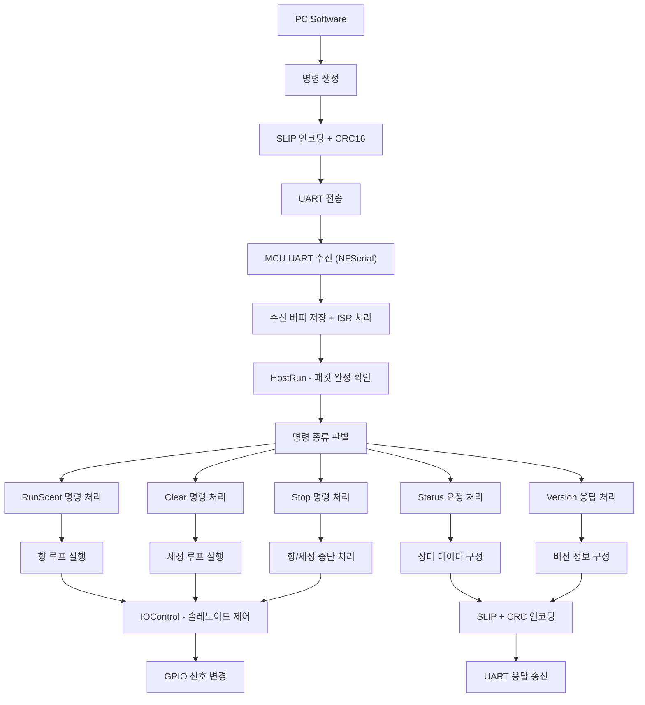

# FrSmart ScentSmart 펌웨어 C/C++ 소스 통합 정리

## 1. 주요 파일 및 역할 분류

|파일명|역할 및 설명|
|---|---|
|**HostRun.cpp / HostRun.h**|시리얼 통신 인터럽트 핸들링, 명령 패킷 수신, 명령 파싱, 명령별 호출 및 응답 송신 처리 메인 모듈|
|**IOControl.cpp / IOControl.h**|MCU 하드웨어 GPIO 초기화 및 제어 (솔레노이드 밸브, LED, RS485 통신 방향 제어 등)|
|**ScentControl.cpp / ScentControl.h**|향 분사 및 세정 제어 로직 (발향·세정 루프 상태 머신, 타이밍 및 솔레노이드 제어, 상태 관리)|
|**NFSerial.cpp / NFSerial.h**|MCU 하드웨어 UART 직접 제어 라이브러리 (버퍼링, 인터럽트 기반 송수신 처리, 레지스터 제어)|
|**FunctionSerial.c / .h**|통신 프로토콜 관련 유틸 함수 (SLIP 인코딩/디코딩, CRC16 체크섬 계산 및 부착 함수)|
|**MODBUS.c / MODBUS.h**|Modbus 프로토콜 명령 생성 함수 (레지스터 읽기/쓰기 명령 구성)|
|**프로그램 소스 (LabWindows/CVI 코드들)**|PC 측 시리얼 통신 초기화, 송수신 함수, UI 콜백, Modbus 명령 처리, 에러 관리 및 상태 표시|
|**TimerOne.cpp / TimerOne.h**|16bit 타이머 제어를 위한 라이브러리 (PWM 발생, 주기 설정, 인터럽트 처리)|
|**IODefine.h**|MCU 핀 번호 및 입출력 논리 레벨 정의 (MCU 하드웨어 핀과 코드 추상화를 위한 매크로)|
|**known_16bit_timers.h**|다양한 MCU별 16bit 타이머 관련 핀 맵핑 정의 (AVR, Teensy, Arduino 등 지원용)|

## 2. 통신 처리 흐름 — HostRun.cpp 중심

- **시리얼 데이터 수신 과정:**
    
    - UART 인터럽트로 한 바이트씩 수신 (`ISR(USART0_RX_vect)` 호출)
        
    - `SerialHostEvent()` 호출, 수신 시작(STX)부터 끝(ETX)까지 버퍼에 저장
        
    - 플래그 세팅 후 `RunSerialHostDataCheck()`가 명령 해석 실행
        
- **명령 파싱 및 처리:**
    
    - 수신된 패킷 내 명령 코드(`R`, `L`, `S`, `G`, `V` 등) 확인
        
    - 각 명령에 맞는 처리 함수 호출(`RunSerialHostCommandRunScent()`, `RunSerialHostCommandRunClear()` 등)
        
- **명령별 동작:**
    
    - 데이터를 ASCII 문자열로 숫자 변환해서 `RunDelayTime`, `RunScentNo`, `RunPieriod` 설정
        
    - 각 명령 함수에서 향-세정 루프 함수(`DoScentBackLoop()`, `DoClearBackLoop()`) 호출로 실행 시작
        
- **응답 송신:**
    
    - 상태 요청 시 패킷 작성 후 `SerialHostSendData()`로 송신
        
    - 체크섬 계산 및 RS485 송수신 방향 제어 포함
        

## 3. 하드웨어 제어 — IOControl.cpp

- **입출력 핀 초기화 (`InitIO`):**
    
    - 주소 핀, 솔레노이드 출력핀, 상태 LED, RS485 송수신 제어 핀 등 설정
        
- **솔레노이드 밸브 ON/OFF 제어 함수:**
    
    - `SolOn(pin)`, `SolOff(pin)`에서 핀에 신호 쓰고 상태 배열 `SolControlStatus[]` 갱신
        
- **향 및 세정 준비 솔레노이드 설정:**
    
    - `ReadyScentSol(int port)` → 향 분사용 솔레노이드 밸브 조합 ON/OFF
        
    - `ReadyClearSol(int port)` → 세정용 솔레노이드 밸브 조합 제어
        
- **RS485 통신 방향 제어:**
    
    - `RS485_Tx_Enable()`, `RS485_Rx_Enable()`로 모드 전환
        
- **WatchDog 신호용 `LiveSignal()` 포함**
    

## 4. 향 동작 루프 — ScentControl.cpp

- **상태 머신으로 향 분사 및 세정 동작 제어:**
    
    - `RunScentLoop()` 와 `RunClearLoop()` 각각 타이밍과 상태 체크로 단계별 진행
        
- **명령별 실행 함수:**
    
    - `DoScentBackLoop()` → 향 분사 명령 수신 후 내부 변수 설정 및 루프 시작
        
    - `DoClearBackLoop()` → 세정 명령 초기화 및 루프 실행
        
    - `DoStopBackLoop()` → 진행 중인 발향 및 세정 정지 처리
        
    - `DoSetSolZeroValveBroadcastBackLoop()`, `DoSetSolZeroValveBackLoop()` → 밸브 제로 위치 조정 및 상태 세팅
        
- **상태 저장 및 호출 구조:**
    
    - 향 번호별 상태 문자 저장(`RunScentStatus[]`)
        
    - 하드웨어 제어 함수(IOControl의 `ResetSol()`, `ReadyScentSol()`) 연동
        

## 5. 저수준 시리얼 처리 — NFSerial.cpp/h

- **UART 하드웨어 레지스터 직접 제어 및 버퍼링:**
    
    - 송수신 버퍼(64byte 크기), 포인터 이동 방식 원형 버퍼 구현
        
- **인터럽트 기반 수신 처리 (`_rx_complete_irq`), 송신 버퍼 비었을 때 보내기(`_tx_udr_empty_irq`)**
    
- **전송 속도(baud) 설정, 데이터 프레임 구성, 송수신 인터럽트 활성화 및 비활성화 지원**
    
- **API 함수: `begin()`, `end()`, `write()`, `read()`, `available()`, `flush()` 등 구현**
    
- **임베디드 MCU 환경(AVR, Teensy 등) 맞춤 레지스터 제어**
    

## 6. 통신 프로토콜 유틸 — FunctionSerial.c/h

- **SLIP 프로토콜 인코딩/디코딩:**
    
    - 데이터 내 제어문자 인코딩(`EncodeSLIP`) 및 복원(`DecodeSLIP`)
        
- **CRC16 체크섬 계산/검증 함수:**
    
    - 표준 CRC16과 Modbus CRC16 지원
        
    - 송수신 시 무결성 확인 및 패킷 뒤에 CRC 추가(`AttachCRC16`, `AttachModbusCRC`)
        

## 7. Modbus 명령 생성 — MODBUS.c/h

- **주요 Modbus Function Code 정의:**
    
    - 읽기 함수(`MBC_RHR` 등), 쓰기 함수(`MBC_WSR` 등)
        
- **명령 패킷 생성:**
    
    - 단일 레지스터 읽기/쓰기 명령 생성 함수(`ReadRegisters_MODBUS`, `WriteSingeRes_MODBUS`)
        
- **송신 버퍼에 명령 프레임 부분 데이터 세팅 후, 송신함수 호출**
    

## 8. Timer 및 PWM 제어 — TimerOne.cpp/h

- **16비트 타이머1 제어**:
    
    - 주기 설정, 시작/정지, PWM 출력 설정
        
    - MCU별 타이머 해상도 및 클럭 설정 맞춤
        
- **ISR(인터럽트 서비스 루틴) 제공 및 사용자 콜백 연결 지원**
    
- **PWM 듀티 비율 설정 및 핀별 제어 구현**
    
- **특정 MCU(AVR, Teensy, ARM 등) 지원 조건부 컴파일**
    

## 9. 편리한 MCU 핀 정의 및 타이머 핀 — IODefine.h, known_16bit_timers.h

- MCU 핀매핑 별 명확한 매크로 정의(입력 주소핀, 솔레노이드 출력핀, LED, RS485 신호 등)
    
- MCU별 16bit 타이머용 핀 정의로 다양한 보드 호환성 지원
    

# 10. 전체 시스템 동작 개요

|단계|동작 및 역할|
|---|---|
|PC SW가 Modbus 또는 자체 프로토콜 명령 생성|`s_serial` 버퍼에 데이터 작성, CRC·SLIP 적용 후 시리얼 송신|
|MCU UART 인터럽트 수신|`NFSerial` ISR 처리로 바이트 저장, 완성 패킷 전까지 버퍼링|
|HostRun에서 패킷 완성 확인 및 명령 파싱|명령 종류에 따른 분기, 타이밍 및 상태 변수 설정|
|향 분사 및 세정 Loop 제어|`ScentControl`의 상태 머신으로 솔레노이드 제어 및 타이밍 진행|
|IOControl로 하드웨어 GPIO 제어|실제 펌프, 밸브, LED 등 GPIO 출력 조작하여 물리적 동작 발생|
|상태 및 결과 응답 송신|상태 정보를 다시 PC에 Modbus 또는 프로토콜 형태로 송신|

# 11. 요약 및 팁

- **각 파일은 역할이 명확하게 분리되어 있어 유지보수와 확장이 용이함**
    
- **시리얼 프로토콜과 버퍼, 인터럽트 처리에 익숙해지는 것이 핵심임**
    
- **상태 머신 형태의 루프 구조가 동작 타이밍 제어 및 안정성 향상에 중요한 역할**
    
- **Modbus 프로토콜과 자체 프로토콜를 조합해 범용성과 성능 고려**
    
- **하드웨어의 실제 동작은 MCU GPIO 제어에 직접 연결되어 있음**
    

필요시, 각 단계 실무에 맞춰 더 자세한 구조도, 함수 호출 체인, 데이터 플로우 등의 문서화도 도와드릴 수 있습니다.  
추가로 특정 파일별 상세 내용, 이해에 어려운 부분, 예제 동작 흐름도 등을 요청해 주세요!



# 1. 전체 시스템 구조 한눈에

**PC 소프트웨어 ↔ RS232/RS485 ↔ MCU(임베디드 펌웨어) ↔ 하드웨어(밸브, 펌프 등)**

# 2. 각 파일별 주요 기능 요약

|파일명|주요 기능/역할 요약|
|---|---|
|**HostRun.cpp/h**|시리얼 명령 수신 ISR, 명령 파싱, 명령별 플래그 & 함수 분기, 응답 송신|
|**IOControl.cpp/h**|핀모드 초기화, 솔레노이드/LED/RS485 입출력 제어, 하드웨어 주소 인식|
|**ScentControl.cpp/h**|향 분사 / 세정 단계별 루프(상태 머신), 실제 분사·세정 실행/종료 타이밍 제어|
|**TimerOne.cpp/h**|16비트 타이머 기반 PWM·주기 인터럽트 관리(일부 하드 실험·모듈 동작용)|
|**NFSerial.cpp/h**|UART 하드웨어 직접 접근(인터럽트/버퍼 기반 송수신), 저수준 시리얼 통신 엔진|
|**IODefine.h**|MCU 핀에 사람이 이해하기 쉬운 매크로 이름 부여(하드/코드 추상화)|
|**known_16bit_timers.h**|보드별 타이머·핀 맵핑(AVR/Teensy/Arduino 계열 MCU 지원)|
|**FunctionSerial.c/h**|CRC16, SLIP 인코딩/디코딩 등 통신 프로토콜 패킷 유틸리티|
|**MODBUS.c/h**|MODBUS 명령 프레임 패킷 생성(레지스터 읽기/쓰기)|
|**프로그램 소스 (CVI 등)**|(PC측) 시리얼 초기화, 송수신 인터페이스, UI이벤트, MODBUS/SLIP/CRC 송수신 구현|

# 3. 데이터 흐름 (명령 → 실행 전체 과정)

## 1) 시리얼 수신, 패킷 파싱 및 명령 분기 (HostRun)

- **인터럽트 ISR**로 한 바이트씩 수신 → 패킷(STX~ETX)인지 확인
    
- 명령문자(`R`, `L`, `S`, `G` 등)에 따라 분기, 파라미터(향,시간,딜레이 등) 아스키→숫자로 변환
    
- 각 명령 처리 함수에서 발향·세정·정지 상태머신(루프) 함수 실행
    
- 진행 상태(분사중 등)는 상태 전역변수·배열로 실시간 관리
    

## 2) 향 분사/세정 루프(상태 머신) (ScentControl)

- `DoScentBackLoop()`, `RunScentLoop()`  
    → 모든 밸브 OFF(ResetSol) → 해당 향 분사용 밸브(ReadyScentSol)만 ON  
    → 딜레이 후, 실제 분사시간 체크 → 분사 끝나면 모두 OFF, 상태 갱신
    
- 세정 및 정지도 위 흐름에서 세정 전용 밸브만 ON/딜레이/끄기 동일 원리
    

## 3) 실제 하드웨어 IO 제어 (IOControl)

- 각 솔레노이드/LED/RS485 핀은 초기화(`InitIO`) 후
    
- ON/OFF 함수(SolOn, SolOff 등) 통해 MCU 핀에 신호 적용
    
- 하드웨어 주소 인식, Watchdog용 신호, LED ON/OFF 등 부가 기능도 포함
    

## 4) 타이머/PWM 처리 (TimerOne)

- 고정 주기로 이벤트가 필요하거나 PWM 신호가 필요할 경우 사용
    
- interrupts attach로 주기별 펌프 동작 또는 시스템 타임 관리(사용 MCU 따라 필수성 다름)
    

## 5) UART(시리얼) 저수준 구현 (NFSerial)

- 수신/송신 버퍼 원형 큐, 인터럽트 기반 읽기/쓰기를 관리
    
- 버퍼 오버플로, 순환 큐, 플래그 등 robust하게 하드웨어와 직접 데이터 송/수신
    

## 6) CRC/SLIP/MODBUS 유틸리티 (FunctionSerial, MODBUS)

- 송신 전 CRC16/SLIP/모드버스 인코딩(PC ←→ 펌웨어) 패킷 완성
    
- 수신 후 패킷 디코딩, 체크섬 검증 통해 데이터 신뢰성 보장
    

# 4. 예시: "향 2번을 5초간 60% 출력으로 분사"가 실행될 때

1. **PC에서 MODBUS 기반 명령 프레임 생성** → 시리얼 전송
    
2. **HostRun.cpp**에서 수신 인터럽트→패킷 저장→ 명령 파싱(향2, 5,60 등)
    
3. **ScentControl.cpp**에서 분사 상태머신 진입
    
    - 시간/밸브 상태 따라 솔레노이드 제어 호출
        
4. **IOControl.cpp**에서 해당 향 밸브 켜기, 끝나면 모두 끄기
    
5. **실행/상태는 RunScentStatus[] 등 배열로 표시,  
    HostRun.cpp의 상태 요청 명령(`G`)시 상태프레임으로 응답**
    
6. **(필요시) 분사 도중/끝에 LED 점등, RS485 모드 변환 등 부가행동 병행**
    

# 5. 각 역할/기능 한눈에 보기

|계층|주요 파일|기능|
|---|---|---|
|UART 전송/수신|NFSerial|(인터럽트/buffer) UART 처리|
|명령 수신/해석|HostRun|패킷 수신→명령 파싱→실행 분기|
|향/세정 실행|ScentControl|발향/세정/정지 상태 머신 & 진행|
|IO 입출력|IOControl|솔레노이드 밸브, LED, RS485 핀 제어|
|타이머/PWM|TimerOne|인터럽트/PWM 신호, 주기적 이벤트 관리|
|CRC/SLIP|FunctionSerial|전송 데이터 패킹/검증 유틸리티|
|명령/프로토콜|MODBUS|MODBUS 명령 프레임 생성|
|핀/하드웨어 정의|IODefine|MCU 핀과 코드 추상화|

# 6. PC와 펌웨어 연동 & 차이점

- **PC쪽(LabWindows, PyQt 등)**:
    
    - RS232 오픈, 설정, 이벤트 설정, MODBUS/SLIP/CRC 프로토콜 생성 및 수신
        
    - 명령 패킷 작성, 응답 패킷 해석, UI에 표시
        
- **MCU 펌웨어(위 파일들)**:
    
    - 모든 바이트 단위 시리얼 수신 직접 처리 (인터럽트 기반)
        
    - 명령 완성 시 패킷 파싱, 각종 루프 진입 및 실제 하드웨어 제어
        
    - 상태/에러 송신 시 MODBUS 등 프로토콜 따라 응답
        

# 7. 이렇게 기억하면 쉽다!

- **HostRun**: 뇌(두뇌), 모든 명령 해석과 실행 결정
    
- **ScentControl**: 일꾼, 실제로 향을 나눠 주거나(분사), 청소(세정) 단계 챙김
    
- **IOControl**: 손과 발, 구체적으로 어떤 밸브·불(LED)을 켜는지 실행
    
- **NFSerial**: 입/귀, 데이터 들어오고 나가는 시리얼 라인 처리
    
- **함수유틸/CRC**: 임시 번역가, 데이터가 손상/변조되지 않게 보호 필터
    

# 8. 전체 흐름 순서 요약

1. 시리얼 데이터 한 바이트씩 인터럽트 수신 (NFSerial+HostRun)
    
2. 패킷 완성 → 명령문자·파라미터 파싱 (HostRun)
    
3. 명령별 상태머신 함수 호출 (ScentControl)
    
4. 배향/세정/정지 각각 단계별 timing & IO 제어 (ScentControl + IOControl)
    
5. 명령·상태 요청에 따라 응답 패킷 생성 및 송신 (HostRun/FunctionSerial/MODBUS)
    
6. 실시간 상태(배열) 유지·보고
    

**이 구조와 계층만 이해하면, 실제 각 함수가 어디서/왜/언제 호출되고, 어떤 하드웨어가 어떻게 움직이는지 쉽게 추적할 수 있습니다!**

아래는 지금까지 정리했던 C 언어(펌웨어) 시스템 전체의 **동작 흐름을 mermaid 플로우차트**로 시각화한 예시입니다.  
실제 프로젝트 전체를 한눈에 파악할 수 있도록,  
**PC(소프트웨어) ↔ 시리얼(통신) ↔ MCU(펌웨어) ↔ 하드웨어**까지 단계별 흐름을 보여줍니다.

```mermaid
```mermaid
flowchart TD

  subgraph PC
    PC_CMD["명령 패킷 생성\n(Modbus/ASCII 등)"]
    PC_SEND["시리얼 송신\n(RS232/RS485)"]
  end

  subgraph MCU
    UART_ISR["UART 수신 ISR\n(NFSerial)"]
    HOST_EVENT["패킷 수집 및 플래그 설정\n(SerialHostEvent)"]
    HOST_PARSE["명령 파싱 및 파라미터 추출\n(RunSerialHostDataCheck)"]
    HOST_SWITCH["명령 분기/실행\n(RunSerialHostCommand)"]

    S_SCENT["향 분사 루프\n(DoScentBackLoop / RunScentLoop)"]
    S_CLEAR["세정 루프\n(DoClearBackLoop / RunClearLoop)"]
    S_STOP["정지 처리\n(DoStopBackLoop)"]
    SEND_RESP["상태 응답 송신\n(SerialHostSendData)"]
    IO_HW["IO 제어\n(IOControl: 솔레노이드/LED/RS485)"]
  end

  subgraph HW
    HW_ACT["솔레노이드/펌프/LED\n동작 실행"]
  end

  PC_CMD --> PC_SEND
  PC_SEND --> UART_ISR
  UART_ISR --> HOST_EVENT
  HOST_EVENT --> HOST_PARSE
  HOST_PARSE --> HOST_SWITCH

  HOST_SWITCH -->|명령: 'R'\n(향분사)| S_SCENT
  HOST_SWITCH -->|명령: 'L'\n(세정)| S_CLEAR
  HOST_SWITCH -->|명령: 'S'\n(정지)| S_STOP
  HOST_SWITCH -->|명령: 'G'/'V'\n(상태요청)| SEND_RESP

  S_SCENT --> IO_HW
  S_CLEAR --> IO_HW
  S_STOP --> IO_HW

  IO_HW --> HW_ACT
  HW_ACT -->|상태 변화\n작업 완료| SEND_RESP
  SEND_RESP --> PC_CMD
```

```

```


## 간단한 설명:

- **1단계:**  
    PC에서 명령 패킷(예: 향분사, 세정, 정지, 상태조회 등)이 생성되어 시리얼(USB/RS232/RS485)로 전송됨.
    
- **2단계:**  
    MCU(펌웨어)는 인터럽트로 바이트 단위 데이터 수신 → 버퍼에 패킷 완성(STX~ETX) → 명령 코드 추출 및 파라미터 분리
    
- **3단계:**  
    명령 종류에 따라 발향/세정/정지/상태요청 등 분기
    
    - 향분사/세정은 각 상태 머신 루프를 돌며 타이머 체크, IO 핀(밸브, LED 등) 제어
        
    - IO제어는 실제 GPIO를 켜거나 끔
        
- **4단계:**  
    모든 하드웨어 동작(향 분사, 세정 밸브, 신호 LED ON/OFF 등) 실시간 실행
    
- **5단계:**  
    명령 응답 또는 상태 변화시 MCU가 상태/완료결과를 다시 PC로 패킷 송신  
    → PC에서는 수신 후 UI 반영, 다음 명령 준비 등 반복
    

이 다이어그램은

- 각 펌웨어 파일 간 역할 구분과
    
- 데이터 및 제어 플로우의 **순환적 구조**
    
- 실무상 실제 “명령→실행→상태응답” 사이클을 한눈에 파악할 수 있게 설계되어 있습니다.
    

원하신다면 개별 명령에 대한 하위 플로우, 또는 실제 데이터 구조를 추가 노드로 상세화시킬 수도 있으니 언제든 말씀해 주세요!