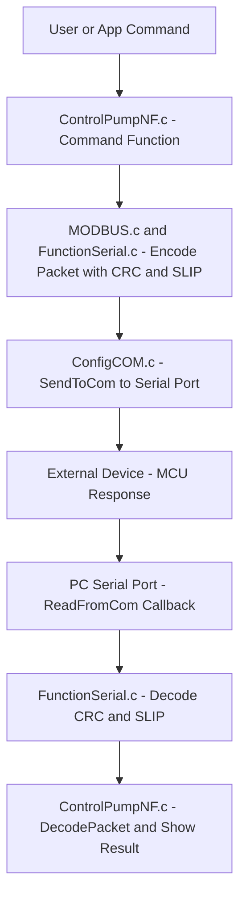

아래는 올려주신 8개 파일(PC용 시리얼 통신/제어 소프트웨어)의 역할, 핵심 함수/구조체 흐름, 그리고 데이터 흐름 다이어그램까지 **최대한 쉽게, 세세하게 정리한 설명**입니다.

# 1. 전체 구조 & 핵심 컨셉

이 프로그램은 **PC(LabWindows/CVI와 C 기반)**에서 **시리얼(RS232/RS485)** 포트를 통해 외부 하드웨어(향 분사용 MCU, 펌프 등)를 제어·모니터링하는 소프트웨어입니다.

- **주요 역할:**
    
    - 시리얼 포트의 열기/설정/종료
        
    - 데이터 패킷 빌드(Modbus, SLIP 등 프로토콜) 및 파싱
        
    - 명령 전송 및 장치 피드백 수신(값, 에러 등)
        
    - (UI와 연동하여) 사용자의 명령을 하드웨어 동작으로 전달
        

# 2. 각 파일별 기능 설명

## 1) ConfigCOM.h & ConfigCOM.c

## (시리얼 포트 설정, 송수신/오류 처리 중심)

- **핵심 구조체**
    
    - `struct s_SERIAL` : 시리얼 포트 속성, 송·수신 버퍼(512B), 각종 플래그, CRC·프로토콜 방식, 장치주소 등 모든 통신 상태 포함
        
- **주요 함수**
    
    - `ReadConfigCom()` : 설정파일(ConfigCom.cfg) 읽어와 포트, 속도, 프로토콜, CRC, 타임아웃 등 값 세팅
        
    - `ActivateCom()` : 포트 열기 & 설정, 콜백 등록 등 활성화
        
    - `SendToCom()` : 데이터 전송(송버퍼/프로토콜/체크섬 포함)
        
    - `ReadFromCom()` : 데이터 수신, 패킷/체크섬 확인 후 파싱/디코딩
        
    - `ResetCom()`, `QuitCom()`, `ErrorCom()` : 각종 상태 초기화/종료/에러 팝업
        

**→ PC에서 장치와 통신을 위한 "기본기능+안전장치+설정" 총괄 파일입니다.**

## 2) ControlPumpNF.h & ControlPumpNF.c

## (프로그램의 메인 로직, UI 연동, 주요 명령 함수)

- **핵심 구조체**
    
    - `S_SCENT s_scent` : 향 관련 현재 명령(번호, 레벨, 시간 등)
        
    - `control_handle`, `acq_handle` : 패널(UI) 핸들
        
- **주요 함수**
    
    - `main()` : 프로그램 시작/초기화, UI 패널 빌드 & 실행
        
    - `InitProcess()` : 시리얼 설정, 포트 초기화, 하드웨어 기본 명령 수행
        
    - `InitProcess_NF()` : 펌프/버전/파워 설정 등 기본 레지스터 명령(시작 시)
        
    - `WriteSingleRes_NF()`, `WriteMultiRes_NF()`, `ReadRegisters_NF()` : 실제 장비 제어/조회용 패킷 빌드 및 시리얼 송수신 함수
        
    - `DecodePacket()` : 수신 데이터 패킷 해석 및 UI 표시
        
    - `Error_NF()` : 에러 코드 해석 및 알림
        

**→ 사용자 명령-----------송신패킷 빌드-------------장치제어----------→ 응답패킷------파싱-----UI/오류반영의 중심**

## 3) MODBUS.h & MODBUS.c

## (Modbus 프로토콜 기반 데이터 프레임 생성, 직접 송수신)

- **주요 함수**
    
    - `ReadRegisters_MODBUS()` : 여러 레지스터 읽기용 패킷 빌드
        
    - `WriteSingeRes_MODBUS()` : 단일 레지스터 쓰기용 패킷 빌드
        
    - 두 함수에서 `s_serial.send[]` 버퍼 빌드 후 `SendToCom()`으로 실제 전송
        

**→ 국제표준 Modbus 프로토콜을 "손으로" 구현, 장치별 명령/응답표조 관리**

## 4) FunctionSerial.h & FunctionSerial.c

## (데이터무결성+SLIP 인코딩/디코딩, 체크섬)

- **SLIP 관련**
    
    - `EncodeSLIP()` : 시리얼 데이터 프레임 생성 시 특수 문자 이스케이프 처리(패킷의 경계/데이터 안전)
        
    - `DecodeSLIP()` : 수신 데이터 역변환(원 데이터 복원)
        
- **CRC(체크섬) 관련**
    
    - `AttachCRC16()`, `CheckCRC16()` : 기본 CRC16 생성/검증
        
    - `AttachModbusCRC()`, `CheckModbusCRC()` : Modbus용 CRC16
        
    - CRC 첨부/확인은 패킷 전송/수신 시 안정성 검증 필수
        

# 3. 파일 간 구조적 흐름 및 호출관계

## 1 시리얼 포트 초기화

`main()` → `InitProcess()`  
  ↓  
`ReadConfigCom()` → 시리얼 설정 로드  
`ActivateCom()` → 포트 오픈 및 콜백 설치

## 2 명령전송 (예: 펌프 동작)

UI 클릭 → `WriteSingleRes_NF()`/`WriteMultiRes_NF()`/`ReadRegisters_NF()`  
  ↓  
Modbus 명령 or 직접 빌드 → `s_serial.send[]`  
  ↓  
`SendToCom()`  
  │— 프로토콜별 인코딩 (`EncodeSLIP` 등)  
  │— CRC 첨부 (`AttachCRC16` 등)  
  ↓  
OS 시리얼 드라이버로 데이터 송신

## 3 응답데이터 수신

포트 이벤트 콜백 → `ReadFromCom()`  
  ↓  
패킷 수신 및 프로토콜 해제 (`DecodeSLIP` 등)  
  ↓  
CRC 검증 (`CheckCRC16`, `CheckModbusCRC`)  
  ↓  
`DecodePacket()` 데이터 해석/에러 확인/값 표시

## [다이어그램]

(텍스트 플로우로 표현)

text

   
   `
   [사용자/프로그램 명령]              │              
   ▼    [ControlPumpNF.c: 명령 함수]              │             
   ▼   [MODBUS.c/FunctionSerial.c: 패킷+CRC/SLIP 인코딩]              │              
   ▼    [ConfigCOM.c: SendToCom → 포트로 송신]              │              
   ▼    [외부장치: 펌웨어/MCU 응답]              │              
   ▼    [PC시리얼포트: ConfigCOM.c: 콜백 → ReadFromCom()]              │              
   ▼   [FunctionSerial.c: SLIP/CRC해제]              │              
   ▼    [ControlPumpNF.c: DecodePacket() → 결과값/에러 표시]
   `





# 4. 주요 예시 시나리오

## ① 펌프값 전송

1. 사용자가 UI(PC)에서 "펌프 동작" 클릭
    
2. → `WriteSingleRes_NF()` 호출: 요청 데이터 생성
    
3. → `SendToCom()`: 전송버퍼 패킹, CRC/SLIP 처리
    
4. → 실제 포트로 바이트 전송(ComWrt)
    
5. 장치에서 응답 들어오면 `ReadFromCom()` 로 수신
    
6. → CRC검증 후 데이터/상태 해석(`DecodePacket()`)
    
7. → UI에 결과/오류 표시
    

## ② 레지스터 읽기

1. UI에서 "센서값 읽기"
    
2. → `ReadRegisters_NF()`
    
3. → Modbus read 패킷 빌드
    
4. → `SendToCom()`
    
5. (아래 동일 동작 반복)
    

# 5. 그림(ASCII-“간단 구조도”)

text

`┌───────────────┐   ┌───────────────┐ 
│    UI/사용자  │              │   외부장치(MCU)│ 
└──────┬────────┘       └──────┬────────┘        
	│                                 ▲       
	  ▼                          │ 
	  ┌────────────┐      TX/RX       ┌───────────┐ 
	  │ControlPump │ ◀───────────────►│시리얼포트 │ │INIT/명령함수│                │ (컴)      │ └────┬───────┘                 └────┬──────┘      │                                │     ▼                                │ ┌─────────────┐                       │ │ MODBUS/SLIP │(패킷인코딩/체크섬/CRC) │ └────┬────────┘                       │      │                                │     ▼                                │ ┌────────────┐                        │ │ ConfigCOM  │(포트오픈/콜백/수신해제) │ └────────────┘                        │      │                                │     ▼                                ▼ [  ControlPump - 결과 해석, 에러알림 및 UI출력  ]`

```mermaid

flowchart LR

    subgraph PC_Side [PC Side]

        UI[User / UI]

        Control[ControlPump - Init and Command]

        Encode[MODBUS / SLIP Encoding with CRC]

        Port[ConfigCOM - Open Port and Handle RX]

        Result[ControlPump - Parse Result and Show]

    end

  

    subgraph MCU_Side [External Device (MCU)]

        MCU[MCU Firmware]

    end

  

    UI --> Control

    Control --> Encode

    Encode --> Port

    Port --> MCU

    MCU --> Port

    Port --> Result

```
# 6. 한 눈에 보는 흐름 요약

- 초기설정 → 포트 오픈/이벤트 등록 → 명령(built/packed) → 시리얼 전송 → 장치 응답 → CRC/SLIP 체크/해제 → 결과 해석 → UI/오류 알림
    

# 이해가 잘 될 수 있는 팁

- **ConfigCOM 시리즈**: "시리얼의 모든 문을 열고 안전하게 닫는 담당자"
    
- **MODBUS, FunctionSerial**: "데이터의 문서포맷·보안인증 담당자"
    
- **ControlPumpNF**: "UI/사용자 측 요청과 결과 종합/실행 본부"
    

