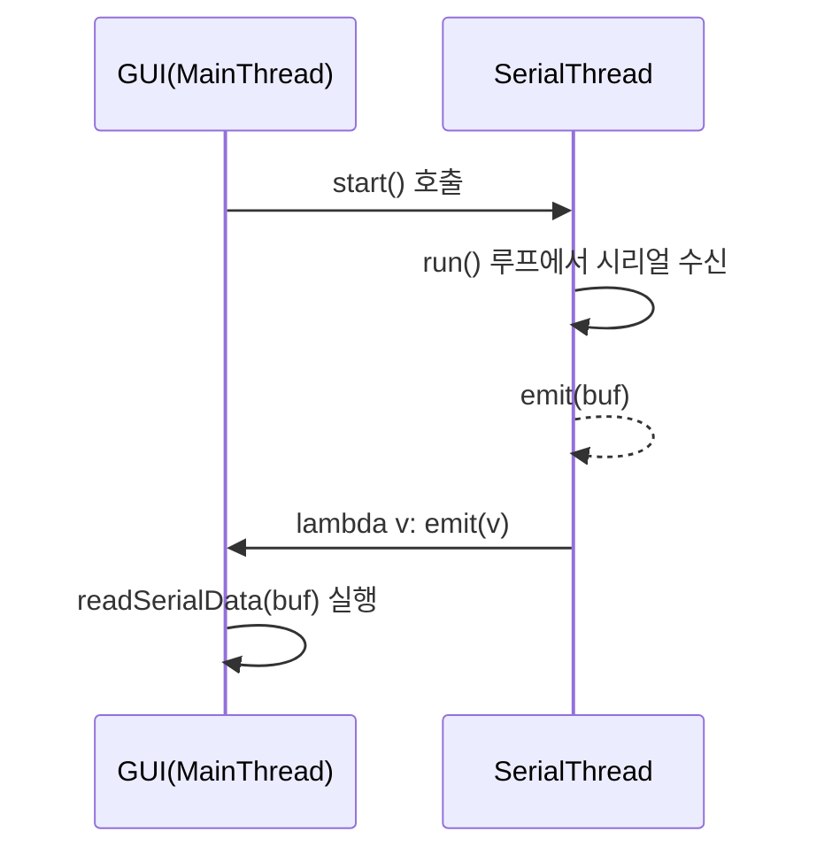

# 시리얼 통신 및 하드웨어 구조
tags: #시리얼통신 #하드웨어 #ScentSmart

## 🔧 구조 요약

- `dsSerial.SerialReadThread`: QThread 기반 수신 스레드
- `write_data(wdata)`: 시리얼 송신
- `readSerialData(rdata)`: 수신 로그 출력 및 파싱

## 🔁 Signal 흐름

```python
self._serial_read_thread._serial_received_data.connect(lambda v: self._serial_received_data.emit(v))
self._serial_received_data.connect(self.readSerialData)
```

→ 쓰레드 emit → UI 스레드 슬롯 실행

# 📡 PySide6 시리얼 통신 스레드 흐름 정리

  

## ✅ 흐름 요약

  

### 1. SerialReadThread (QThread)

- 시리얼 포트에서 데이터를 읽는 백그라운드 스레드

  

### 2. Signal.emit(data)

- 데이터를 수신하면 즉시 `emit()` 호출로 시그널 발신

  

### 3. lambda v: emit(v)

- 내부 시그널을 외부 메인 클래스의 시그널로 중계 (단순 전달자 역할)

  

### 4. UiDlg._serial_received_data

- 메인 클래스의 시그널 객체 (슬롯 연결 준비)

  

### 5. UiDlg.readSerialData()

- 최종적으로 수신 데이터를 UI에 출력하거나 처리하는 함수

  

---

  

## 🧵 시그널-슬롯 + 스레드 흐름

  

### ✅ 실행 주체별 정리

  

| 단계 | 동작 설명 | 실행 스레드 |

|------|----------|-------------|

| 1 | 시리얼 데이터 수신 | SerialReadThread (서브) |

| 2 | `_serial_received_data.emit(data)` 호출 | SerialReadThread (서브) |

| 3 | `lambda v: emit(v)` 호출 | SerialReadThread (서브) |

| 4 | 메인 클래스의 `emit(v)` 호출 | SerialReadThread → 이벤트 큐 |

| 5 | `readSerialData(v)` 실행 | 메인(UI) 스레드 |

  

---

  

## 🔄 시각적 요약

  

```

[SerialReadThread (QThread)]                [Main/UI Thread]

          │                                          │

          │  ──(데이터 수신)──▶                       │

          │  emit(_serial_received_data)             │

          │  ──▶ lambda v: emit(v)                   │

          │                                          │

          └────────────────────┐                    │

                               ▼                    ▼

                          emit(ScentSmart 시그널) → readSerialData() 실행

                                                      ↑

                                                UI 작업: QTextEdit 출력

```

  

---

  

## ✅ 전체 통신 흐름 코드 기반 정리

  

### 📌 초기화 및 쓰레드 연결

  

```python

self.setSerialReadThread()

```

  

- `serial.Serial()` 로 포트 오픈 → `_serial`에 저장

- `dsSerial.SerialReadThread(_serial)` 생성

  

### 📌 시그널 연결

  

```python

self._serial_read_thread._serial_received_data.connect(

    lambda v: self._serial_received_data.emit(v)

)

self._serial_received_data.connect(self.readSerialData)

```

  

- 첫 줄: 서브스레드 → 메인스레드 중계용

- 둘째 줄: 메인스레드 슬롯 실행

  

### 📌 데이터 수신 → 실행 흐름

  

```python

self._serial_received_data.emit(buf)

```

  

1. lambda → `emit(v)`

2. PySide6: 메인 스레드 이벤트 큐 등록

3. `readSerialData(v)` 실행

  

---

  

## 🧠 개념 요약

  

### ✅ Signal 선언

  

```python

_serial_received_data = Signal(bytes, name="serialReceivedData")

```

  

- 전달할 데이터 타입 지정

- 이름은 디버깅/UI 디자이너에서 식별용

  

### ✅ lambda 쓰는 이유

  

```python

lambda v: self._serial_received_data.emit(v)

```

  

- 실행이 아닌 **연결만 담당**

- emit 시점에만 실행됨

  

### ✅ PySerial + QThread 쓰는 이유

  

- PySerial은 **blocking I/O**

- GUI 멈춤 방지를 위해 QThread 필수

- Qt는 이벤트 큐를 통해 스레드 간 안전한 통신을 보장

  

---

  

## 🧩 Signal 객체 정의

  

```python

class SerialReadThread(QThread):

    _serial_received_data = Signal(bytes)

```

  

- 클래스 변수지만 인스턴스처럼 연결 가능

  

---

  

## ❗ 기타 주의사항

  

- `Signal.connect()`와 `_connect()` (dsSerial 내 함수)는 이름만 같고 **완전 다름**

- Signal은 PySide6의 QObject 기반 이벤트 시스템임

  

---

  

## 📊 클래스 변수 vs 인스턴스 변수

  

- `Signal()`은 클래스 변수

- `self.xxx`로 접근하면 인스턴스 전용처럼 동작

- list/dict 등 가변 객체는 모든 인스턴스가 공유하므로 주의

  

---

  

## 📈 시각적 다이어그램 (Mermaid)

  



  

---

  

## ✅ 요약

  

> SerialReadThread는 백그라운드에서 데이터를 수신하고,

> 시그널을 통해 메인스레드의 `readSerialData` 슬롯에 안전하게 전달합니다.

> Qt는 이벤트 큐를 통해 이 모든 동작을 **스레드 안전**하게 관리합니다.


