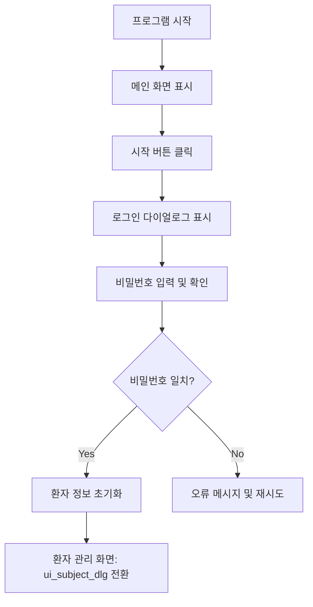

---

````markdown
# 🔐 ScentSmart.py: 로그인 흐름 및 로그인 성공 후 UI 동작 구조

본 문서는 ScentSmart 프로그램에서 **"시작" 버튼 클릭부터 로그인, 로그인 성공 후 환자 관리 화면으로의 흐름**을 함수 및 UI 단위로 정리한 구조도입니다.

---

## 🚀 1. 프로그램 실행 ~ 시작 버튼 동작

- 프로그램 실행 시 호출:

```python
UiDlg.uiDlgStart() → self.ui_main_dlg.show()
````

- 메인화면(`self.ui_main_dlg`)이 표시됨
    

### 🔘 시작 버튼 동작

- 버튼 객체:  
    `self.ui_main_dlg.ui_main_btn_login`
    
- 연결 함수:
    
    ```python
    self.ui_main_dlg.ui_main_btn_login.clicked.connect(self.uiMainBtnLogin)
    ```
    
- `uiMainBtnLogin()` 함수 내부 주요 동작:
    
    - 사운드 재생
        
    - 설정 UI 업데이트
        
    - 로그인 입력 필드 초기화
        
    - 사용자 및 검사 정보 초기화
        
    - 이전 창 정보 저장 → 로그인 다이얼로그 표시:
        
        ```python
        self.uiDlgShow(self.ui_dlg_login)
        ```
        

---

## 🔑 2. 로그인 입력 및 인증 처리

### 로그인 UI 구성

- 다이얼로그 객체: `self.ui_dlg_login`
    
- 구성:
    
    - 비밀번호 입력창: `le_pw`
        
    - 로그인 버튼: `pb_start`
        

### 연결된 시그널

```python
self.ui_dlg_login.le_pw.returnPressed.connect(self.uiDlgLoginStart)
self.ui_dlg_login.pb_start.clicked.connect(self.uiDlgLoginStart)
```

---

## 🔐 3. 로그인 성공 시 동작 함수

### 로그인 처리 함수: `uiDlgLoginStart()`

- 내부 처리 순서:
    

```python
if checkPW(input_pw):
    self.clearPWEdit()
    self.clearPWText()
    self.initSubjectInfo()
    self.updateUiSujbect()
    self.uiDlgChangeWithDlg(self.ui_main_dlg, self.ui_dlg_login, self.ui_subject_dlg)
```

- 기능 요약:
    
    - 비밀번호 검증 (`checkPW`)
        
    - 입력칸 및 상태 초기화
        
    - 피험자 정보 초기화 및 불러오기
        
    - **환자 관리 화면(`ui_subject_dlg`)으로 전환**
        

---

## 👀 4. 로그인 성공 후 표시되는 UI

### 🔹 화면 구조

|화면 이름|UI 객체|기능|
|---|---|---|
|환자 관리 메인|`ui_subject_dlg`|피험자 리스트 표시, 선택 등|
|환자 추가 창|`ui_dlg_subject_add`|새 피험자 등록|
|환자 삭제 창|`ui_dlg_subject_delete`|기존 피험자 삭제|
|환자 선택 확인|`ui_dlg_subject_next`|선택 피험자 확인 후 다음 진행|

---

## 🧭 5. 전체 흐름 요약



---

## 🧩 6. 핵심 함수 요약

|함수 이름|역할|
|---|---|
|`uiMainBtnLogin()`|시작 버튼 클릭 시 로그인 UI 표시|
|`uiDlgLoginStart()`|로그인 입력 확인 및 검증|
|`checkPW()`|설정 파일의 암호문과 비교|
|`initSubjectInfo()`|피험자 데이터 구조 초기화|
|`updateUiSujbect()`|피험자 리스트 UI 갱신|
|`uiDlgChangeWithDlg()`|UI 전환 처리 (메인 → 로그인 → 환자)|

---

## ✅ 결론

- 로그인 성공 시 표시되는 화면은 **환자 정보 관리 화면(`ui_subject_dlg`)**입니다.
    
- 이 화면에서는 피험자 정보를 **추가 / 삭제 / 검색 / 선택**할 수 있습니다.
    
- 로그인 → 환자 선택 → 검사로 자연스럽게 이어지는 흐름이며, 향후 모든 검사/훈련은 이 선택된 피험자를 기준으로 수행됩니다.
    
